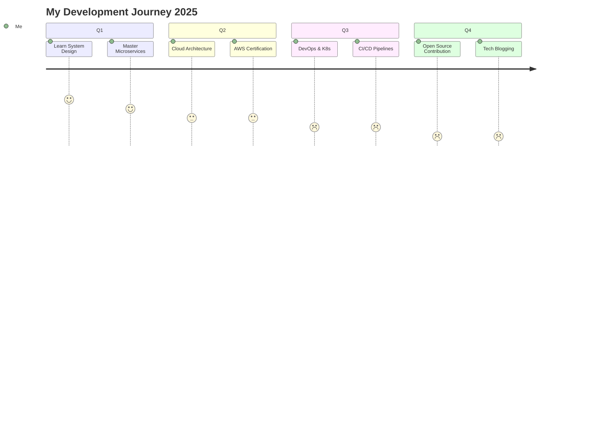

<!-- Opening GIF Banner -->
<div align="center">
  
</div>

<!-- Animated Header -->
<div align="center">
  
</div>

<!-- Coding GIF -->
<div align="center">
  
</div>

<!-- Animated Typing -->
<div align="center">
  
</div>

<!-- Profile Views & Social Links -->
<div align="center">
  
  
  
  <br><br>
  
  [](https://linkedin.com/in/yourprofile)
  [](https://github.com/yourusername)
  [](mailto:hasanalipali2@gmail.com)
  [](https://yourwebsite.com)
  
</div>

<br>

<!-- About Me Section -->


###  About Me


- 🏛️ **Education**: B.Tech in Electronics & Communication @ **IIIT Guwahati** (2026)
- 💼 **Current Role**: Frontend Developer @ **Rainbow Educational Institute**  
- 🔭 **Focus**: Building scalable microservices and distributed systems
- 🌱 **Learning**: Advanced System Design, Cloud Architecture & DevOps
- ⚡ **Fun Fact**: I debug code like solving puzzles - it's addictive!
- 🎯 **2025 Goals**: Contributing to Open Source projects & mastering Kubernetes
- 💬 **Ask me about**: React, Node.js, System Design, or anything tech!

<br clear="both">

---

###  Tech Stack & Tools


#### 🎨 Frontend Development
<div align="center">
  
  
  
  
  
  
  
  
  
  
</div>

#### ⚙️ Backend & Database
<div align="center">
  
  
  
  
  
  
  
  
  
  
</div>

#### 🛠️ DevOps & Tools
<div align="center">
  
  
  
  
  
  
  
  
  
  
</div>

#### 💻 Programming Languages
<div align="center">
  
  
  
  
  
</div>

---

###  Featured Projects

<div align="center">
  
</div>

<br>

<table align="center">
  <tr>
    <td width="50%">
      <h3 align="center">🤖 Zapier Clone - Workflow Automation</h3>
      <div align="center">
        <br>
        <p>
          <a href="https://github.com/yourusername/zapier-clone">
            
          </a>
        </p>
        <p>
          
          
          
          
        </p>
        <p><strong>✨ 5 Microservices | 99.9% Uptime | 25% Faster Development</strong></p>
      </div>
    </td>
    <td width="50%">
      <h3 align="center">🚗 TukTuk - Ride Hailing Platform</h3>
      <div align="center">
        <br>
        <p>
          <a href="https://github.com/yourusername/tuktuk">
            
          </a>
        </p>
        <p>
          
          
          
          
        </p>
        <p><strong>🔒 RESTful API | JWT Auth | 98% XSS Prevention</strong></p>
      </div>
    </td>
  </tr>
  <tr>
    <td width="50%">
      <h3 align="center">📹 CamCall - P2P Video Chat</h3>
      <div align="center">
        <br>
        <p>
          <a href="https://github.com/yourusername/camcall">
            
          </a>
        </p>
        <p>
          
          
          
        </p>
        <p><strong>📡 Real-time P2P | Ultra-low Latency | STUN/TURN</strong></p>
      </div>
    </td>
    <td width="50%">
      <h3 align="center">🎯 More Projects Coming Soon!</h3>
      <div align="center">
        <br>
        
        <br><br>
        <p><strong>Working on something awesome...</strong></p>
        <p>
          
        </p>
      </div>
    </td>
  </tr>
</table>

---

###  GitHub Analytics

<br>

<div align="center">
   
  
</div>

<div align="center">
  
</div>

<div align="center">
  
</div>

<details>
<summary><b>📊 Weekly Development Breakdown</b></summary>
<br>

<!--START_SECTION:waka-->
```text
TypeScript   15 hrs 41 mins  ████████████░░░░░░░  58.70%
JavaScript   6 hrs 12 mins   ██████░░░░░░░░░░░░░  23.23%
React        2 hrs 50 mins   ██░░░░░░░░░░░░░░░░░  10.63%
CSS          1 hr 20 mins    █░░░░░░░░░░░░░░░░░░  05.01%
JSON         38 mins         ░░░░░░░░░░░░░░░░░░░  02.43%
```
<!--END_SECTION:waka-->

</details>

---

### 🏆 Achievements & Milestones

<div align="center">
  
</div>

<table align="center">
  <tr>
    <td align="center">
      
      <br><br><strong>92% in Class 12</strong>
      <br>CBSE Board 2022
    </td>
    <td align="center">
      
      <br><br><strong>Round 1 Cleared</strong>
      <br>Software Development 2024
    </td>
  </tr>
  <tr>
    <td align="center">
      
      <br><br><strong>Round 1 Qualified</strong>
      <br>Campus Quiz 2024
    </td>
    <td align="center">
      
      <br><br><strong>40% Faster Load Times</strong>
      <br>25% Better Engagement
    </td>
  </tr>
</table>

---

### 📈 Current Focus & Learning Path

<div align="center">
  
</div>



---

### 💭 Developer Quote of the Day

<div align="center">
  
</div>

---

### 🤝 Let's Connect & Collaborate!

<div align="center">
  
  <br><br>
  
  
  
  <br>
  
  ### 📬 Reach Out to Me!
  
  <a href="mailto:hasanalipali2@gmail.com">
    
  </a>
  <a href="https://linkedin.com/in/yourprofile">
    
  </a>
  
  <br><br>
  
  <i><b>"Building the future, one commit at a time! 🚀"</b></i>
  
  <br><br>
  
  ⚡ **Open for collaborations, freelance work, and exciting opportunities!**
  
</div>

<br>

<!-- Snake eating contributions -->
<div align="center">
  
</div>

<!-- Wave Footer -->

