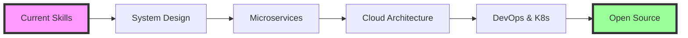

<!-- Animated Wave Header -->

<!-- Animated Typing Introduction -->

<!-- Profile Views Counter with Animation -->

<!-- Social Links as Badges -->
  

 

<!-- About Me Section with Side Animation -->

###  About Me

- 🏛️ **Education**: B.Tech in Electronics & Communication @ **IIIT Guwahati** (2026)
- 💼 **Current Role**: Frontend Developer @ **Rainbow Educational Institute**
- 🔭 **Focus**: Building scalable microservices and distributed systems
- 🌱 **Learning**: Advanced System Design, Cloud Architecture & DevOps
- ⚡ **Fun Fact**: I debug code like solving puzzles - it's addictive!
- 🎯 **2025 Goals**: Contributing to Open Source projects & mastering Kubernetes
- 💬 **Ask me about**: React, Node.js, System Design, or anything tech!

 

---

###  Tech Stack

<b>🎨 Frontend Universe</b>

 

  
  
  
  
  
  
  
  

<b>⚙️ Backend & Database</b>

 

  
  
  
  
  
  
  
  

<b>🛠️ DevOps & Tools</b>

 

  
  
  
  
  
  
  
  

---

###  Featured Projects

 

<table>
<tr>
<td width="50%">

<h3 align="center">🤖 Zapier Clone - Workflow Automation</h3>

  
    
  

    
    
    
    
  

  
<strong>5 Microservices | 99.9% Uptime | 25% Faster Development</strong>

</td>
<td width="50%">

<h3 align="center">🚗 TukTuk - Ride Hailing Platform</h3>

  
    
  

    
    
    
    
  

  
<strong>RESTful API | JWT Auth | 98% XSS Prevention</strong>

</td>
</tr>
<tr>
<td width="50%">

<h3 align="center">📹 CamCall - P2P Video Chat</h3>

  
    
  

    
    
    
  

  
<strong>Real-time P2P | Ultra-low Latency | STUN/TURN</strong>

</td>
<td width="50%">

<h3 align="center">🎯 More Projects Coming Soon!</h3>

   
  
    
  
<strong>Working on something awesome...</strong>

  

    
  

</td>
</tr>
</table>

---

###  GitHub Analytics

 

  

  

<b>📊 Contribution Graph</b>

 

  

---

### 🏆 Achievements & Milestones

 

  

<table align="center">
  <tr>
    <td align="center">
      
       <strong>92% in Class 12</strong>
       CBSE Board 2022
    </td>
    <td align="center">
      
       <strong>Round 1 Cleared</strong>
       Software Development 2024
    </td>
  </tr>
  <tr>
    <td align="center">
      
       <strong>Round 1 Qualified</strong>
       Campus Quiz 2024
    </td>
    <td align="center">
      
       <strong>40% Faster Load Times</strong>
       25% Better Engagement
    </td>
  </tr>
</table>

---

### 📈 Current Focus & Learning Path

 

---

### 💭 Random Dev Quote

 

  

---

### 🤝 Let's Connect!

 

  
    
  <i>"Building the future, one commit at a time!"</i>
    
  <b>⚡ Open for collaborations and exciting opportunities!</b>
    
  

 

<!-- Snake animation -->

  

<!-- Wave Footer -->

