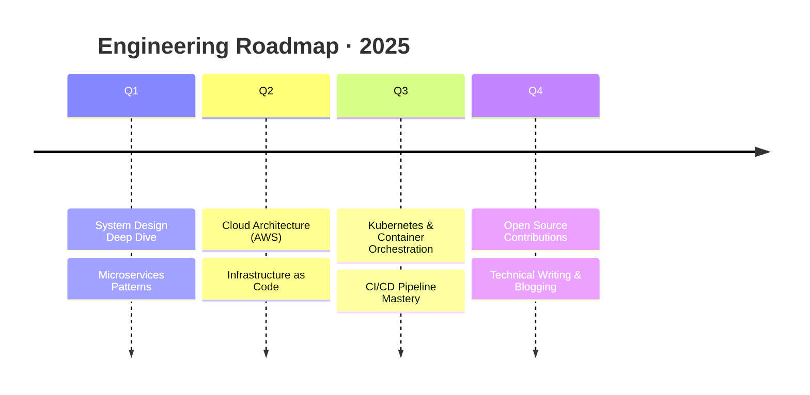

<!-- ============================================================
     MOHAMMED HASAN — GitHub Profile README
     Design: IDE/terminal-noir with cyan-violet gradient accents
     ============================================================ -->

<!-- TOP WAVE HEADER -->
<div align="center">
  
</div>

<!-- ANIMATED TYPING — terminal style -->
<div align="center">
  
</div>

<br>

<!-- SOCIAL BADGES — clean row -->
<div align="center">

[](https://linkedin.com/in/yourprofile)
[](https://github.com/yourusername)
[](https://yourwebsite.com)
[](mailto:hasanalipali2@gmail.com)


</div>

<br>

---

## `> init --profile`

```
┌─────────────────────────────────────────────────────────────────┐
│  🎓  B.Tech ECE  ·  IIIT Guwahati  ·  2026                      │
│  💼  Frontend Dev  @  Rainbow Educational Institute             │
│  🔭  Building microservices, distributed systems & OSS tools    │
│  🌱  Deepening: System Design · Cloud Architecture · DevOps     │
│  🎯  2025: Kubernetes mastery + Open Source contributions        │
│  ⚡  I debug code the way others solve crosswords — obsessively  │
└─────────────────────────────────────────────────────────────────┘
```

---

## `> ls ./stack`

<table>
  <tr>
    <td valign="top" width="33%">

**`// Frontend`**
```
React ············ ████████████ ★★★★★
Next.js ·········· ██████████░░ ★★★★☆
TypeScript ······· ████████████ ★★★★★
Tailwind CSS ····· ██████████░░ ★★★★☆
JavaScript ······· ████████████ ★★★★★
HTML5 / CSS3 ····· ████████████ ★★★★★
Bootstrap ········ ████████░░░░ ★★★★☆
```

  </td>
  <td valign="top" width="33%">

**`// Backend & DB`**
```
Node.js ·········· ████████████ ★★★★★
Express.js ······· ████████████ ★★★★★
MongoDB ·········· ██████████░░ ★★★★☆
PostgreSQL ······· █████████░░░ ★★★★☆
Redis ············ ████████░░░░ ★★★★☆
Socket.io ········ ██████████░░ ★★★★☆
JWT / Auth ······· ████████████ ★★★★★
Firebase ·········  ███████░░░░░ ★★★☆☆
```

  </td>
  <td valign="top" width="33%">

**`// DevOps & Tools`**
```
Git / GitHub ····· ████████████ ★★★★★
Docker ··········· █████████░░░ ★★★★☆
Nginx ············ ████████░░░░ ★★★★☆
Linux ············ █████████░░░ ★★★★☆
Postman ·········· ████████████ ★★★★★
Jest ············· ████████░░░░ ★★★☆☆
C++ / Python ····· █████████░░░ ★★★★☆
VS Code ·········· ████████████ ★★★★★
```

  </td>
  </tr>
</table>

---

## `> cat ./projects`

<details open>
<summary><b>🤖 Zapier Clone — Workflow Automation Engine</b></summary>

<br>

> *Automate anything. Connect everything.*

A production-grade workflow automation platform built on **5 independent microservices** communicating via message queues. Supports triggers, conditions, and multi-step action chains — think Zapier, but yours.

| Metric | Value |
|--------|-------|
| 🏗 Architecture | 5 Microservices + Event Queue |
| ⚡ Uptime | 99.9% |
| 🚀 Dev Velocity | 25% faster feature delivery |
| 🔧 Stack | TypeScript · Node.js · React · Docker · PostgreSQL |

[](https://github.com/yourusername/zapier-clone)

</details>

<details open>
<summary><b>🚗 TukTuk — Ride Hailing Platform</b></summary>

<br>

> *From point A to point B, securely.*

A full-stack ride-hailing app with real-time location tracking, driver-rider matching, and robust JWT-based authentication. Built to handle high-concurrency scenarios with XSS prevention baked in.

| Metric | Value |
|--------|-------|
| 🔒 Security | 98% XSS Prevention Rate |
| 🌐 API Design | RESTful · JWT Auth · Role-based Access |
| ⚙️ Stack | Node.js · MongoDB · React · Express · JWT |

[](https://github.com/yourusername/tuktuk)

</details>

<details open>
<summary><b>📹 CamCall — Peer-to-Peer Video Chat</b></summary>

<br>

> *Real-time communication, no intermediary.*

A WebRTC-powered P2P video calling app with ultra-low latency. Uses Socket.io for signaling and implements STUN/TURN servers for NAT traversal — working even behind firewalls.

| Metric | Value |
|--------|-------|
| 📡 Protocol | WebRTC + Socket.io Signaling |
| ⚡ Latency | Sub-100ms P2P connection |
| 🛡 NAT Traversal | STUN / TURN server support |
| ⚙️ Stack | WebRTC · Socket.io · Node.js |

[](https://github.com/yourusername/camcall)

</details>

---

## `> git log --stats`

<div align="center">
  
  
</div>

<div align="center">
  
</div>

<details>
<summary><b>📊 Weekly Dev Breakdown</b></summary>
<br>

```text
TypeScript   15 hrs 41 mins  ████████████░░░░  58.70 %
JavaScript    6 hrs 12 mins  ██████░░░░░░░░░░  23.23 %
React         2 hrs 50 mins  ███░░░░░░░░░░░░░  10.63 %
CSS           1 hr  20 mins  █░░░░░░░░░░░░░░░  05.01 %
JSON            38 mins      ░░░░░░░░░░░░░░░░  02.43 %
```

</details>

---

## `> cat ./achievements.log`

```
[2022]  CBSE Class 12              →  92%  ························· ✅ Academic Excellence
[2024]  Flipkart GRiD 6.0          →  Round 1 Cleared ············· ✅ Software Development Track
[2024]  Tata Crucible Campus Quiz  →  Round 1 Qualified ··········· ✅ National Level Competition
[2024]  Performance Optimization   →  40% faster load times ······· ✅ 25% engagement uplift
```

---

## `> roadmap --year 2025`



---

## `> ping --contact`

<div align="center">

```
╔══════════════════════════════════════════════╗
║   Open to: Collaborations · Freelance ·      ║
║            Full-time Opportunities           ║
║                                              ║
║   Response time: < 24 hours                  ║
╚══════════════════════════════════════════════╝
```

[](mailto:hasanalipali2@gmail.com)
[](https://linkedin.com/in/yourprofile)

<br>

*"Ship fast. Learn faster. Build things worth maintaining."*

</div>

<br>

<!-- Contribution Snake -->
<div align="center">
  
</div>

<!-- FOOTER WAVE -->

